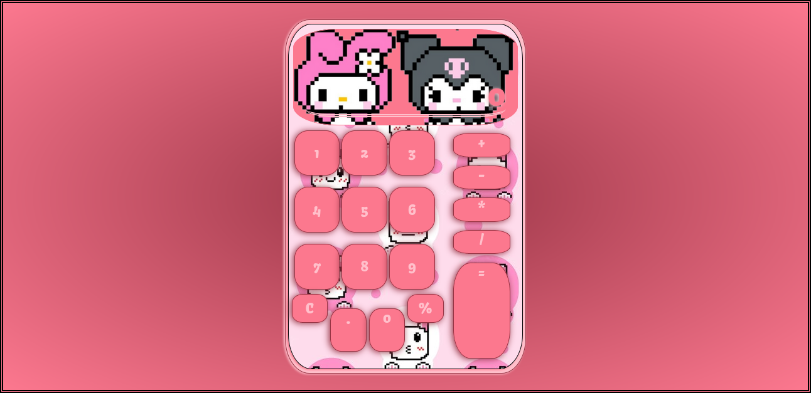

# Portfolio de Alan Torino

Hola, soy **Alan**. Desarrollador web y tester QA son los roles en los que me estoy capacitando actualmente.

En mi portfolio se pueden encontrar los proyectos personales en los que he estado trabajando.

A continuacion describire algunos de ellos y proporcionare el link para encontrarlos en netlify.

## Kawaiiculator

Una calculadora con un diseño kawai que hice con HTMl CSS y Js. Todo el codigo esta diseñado por mí.

v1.0.0 //////// Los botones de '.' y '%' aún carecen de funcionalidad. 

### [Enlace a Kawaiiculator](https://kawaiiculator.netlify.app/)

## The legendario

Mi primer proyecto interesante en cuanto a tamaño respecta. La idea es simular una pagina de juego online, todo el contenido es ficticio,
aunque me gustaria en un futuro inculir algo de contenido. Lo estoy construyendo enteramente con CSS, HTML y Javascript puro.

### [Enlace a The Legendario(https://the-legendario-portfolio-at.netlify.app/)

## Certificado

Un certificado de practica de CSS y HTML.

### [Enlace a Certificado](https://diploma-portfolio-at.netlify.app/)

## Login

Un login de practica con CSS y HTML. Tiene interactividad con CSS.

### [Enlace a Login](https://login-portfolio-at.netlify.app/)

